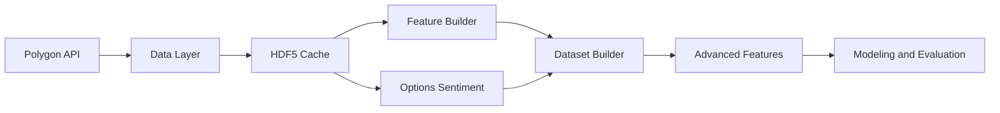

# 🧠 OAMI — Options-Aware Market Intelligence  
**Version:** 0.3.0  
**License:** MIT  
**Author:** skyliquid22  

---

## 📘 Overview
OAMI (Options-Aware Market Intelligence) is a **modular, machine-learning-ready framework** for analyzing equities and options data.  
It fetches, caches, and processes both **market** and **options chain** data to engineer advanced quantitative features for trading strategy research.

Built for:
- Data scientists and quants who want to explore market microstructure & sentiment  
- ML practitioners building predictive models using market and options signals  
- Researchers studying the relationships between implied volatility, returns, and risk  

---

## ⚙️ Core Features
- 🧩 **Market Data Layer** — Robust Polygon.io integration with retry logic, caching, and error handling  
- 💾 **HDF5 Cache** — Consolidated store at `data/cache/oami_store.h5` for both market bars and per-contract aggregates  
- 🧮 **Feature Engineering** — SMA, EMA, RSI, MACD, Bollinger Bands, ATR, lags, rolling stats  
- 📊 **Options Sentiment** — Put/Call ratios, OI ratios, rolling vol metrics, sentiment index  
- 🔗 **Cross-Asset Context (v0.3)** — SPY/QQQ/VIX correlation and beta placeholders (to be expanded)  
- 🧠 **Advanced Features** — PCA-based dimensional reduction and implied volatility structures  
- 🧰 **Config-Driven Design** — YAML-based control over parameters and feature toggles  
- 🧪 **Testing & CI/CD** — Full Pytest suite with GitHub Actions integration  

---

## 🧱 Architecture



Each module communicates through standardized Pandas DataFrames and supports both **live API** and **offline CSV** data.

---

## 📂 Project Structure
```
OAMI_v0.3.0/
├── configs/
│   ├── config.yaml
│   └── logging_config.json
├── data/
│   └── cache/
│       └── oami_store.h5
├── notebooks/
│   ├── 00_data_ingestion_demo.ipynb
│   ├── 01_feature_importance.ipynb
│   └── 02_advanced_features.ipynb
├── src/
│   └── oami/
│       ├── data_layer.py
│       ├── features.py
│       ├── dataset.py
│       ├── features_crossasset.py
│       ├── features_select.py
│       └── features_advanced.py
├── tests/
│   ├── test_features.py
│   ├── test_options_features.py
│   ├── test_dataset.py
│   └── resources/
│       ├── market_sample.csv
│       └── options_sample.csv
├── .github/workflows/tests.yml
├── .env.example
├── requirements.txt
├── setup.cfg
├── LICENSE
└── README.md
```

---

## 🚀 Quickstart

### 1️⃣ Clone the Repository
```bash
git clone git@github.com:skyliquid22/OAMI.git
cd OAMI
```

### 2️⃣ Create a Virtual Environment
```bash
python -m venv .venv
source .venv/bin/activate
pip install -r requirements.txt
pip install -r requirements-dev.txt
```

### 3️⃣ Set Your Environment Variable
```bash
export POLYGON_API_KEY="your_real_polygon_api_key"
```

### 4️⃣ Run Tests
```bash
pytest --maxfail=1 --disable-warnings --cov=src/oami --cov-report=term-missing
```

### 5️⃣ Run the Main Pipeline
```bash
python -m src.main
```

This will automatically:
- load cached sample data (SPY & SPY options)
- generate feature sets
- build unified dataset
- log outputs in `./logs/oami.log`

---

## 📈 Example Workflow (Python)
```python
from oami.data_layer import get_market_data, get_options_data
from oami.features_advanced import AdvancedFeatureBuilder

market = get_market_data("SPY", "2024-01-01", "2024-06-30")
contracts = get_options_data("SPY", "2024-01-01", "2024-06-30")

afb = AdvancedFeatureBuilder(market, contracts)
df = (afb
      .add_crossasset(benchmarks=["SPY", "VIX"])
      .add_options_implied()
      .apply_selection(n_components=5)
      .finalize())

print(df.head())
```

---

## 🧪 Testing & Quality
- **Framework:** `pytest`
- **Coverage:** 75% minimum (enforced via `setup.cfg`)
- **Linting:** `flake8`, `black`, `isort`
- **CI:** GitHub Actions (`.github/workflows/tests.yml`)

Run all checks locally:
```bash
black src tests
isort src tests
flake8 src tests
pytest
```

---

## 🧭 Roadmap
| Milestone | Description |
|------------|--------------|
| **v0.3.1** | Implement real cross-asset correlations (SPY, QQQ, VIX) |
| **v0.3.2** | Add volatility features (rolling std, drawdown, clustering index) |
| **v0.3.3** | Integrate feature importance across ML models |
| **v0.4.0** | Launch model training & backtesting pipeline |
| **v0.5.0** | Deploy real-time async data stream and queue processing |

---

## 📜 License
MIT License © 2025 [skyliquid22](https://github.com/skyliquid22)

---

## 💬 Acknowledgments
- [Polygon.io](https://polygon.io) — for data access APIs  
- [TA-Lib / Technical Analysis Library](https://github.com/bukosabino/ta) — for indicator functions  
- [Scikit-Learn](https://scikit-learn.org/) — for PCA, RFE, and feature selection tools  
- [XGBoost](https://xgboost.readthedocs.io/) — for advanced model integration  

---

## 🧩 Maintainer Notes
- All caching and feature generation is **configurable via `configs/config.yaml`**
- Default data is offline (SPY, 3-month sample) for reproducibility
- Uses a JSON-based logger (`logging_config.py`) compatible with log collectors and MLFlow

---

> _“The future belongs to those who quantify uncertainty.”_
